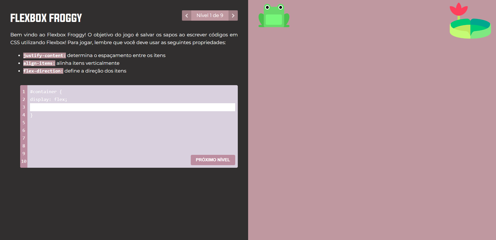

# flex-box-froggy

O Flexbox Froggy é um jogo didático para aprender Flexbox.

O objetivo é posicionar os sapos nas vitórias-régias e concluir todos os níveis. Para isso, devem ser utilizadas as propriedades de flexbox *justify-content*, *flex-direction* e *align-items*.



### Tecnologias utilizadas

O projeto foi construído utilizando o framework Vue.js na versão 3. Para gerenciamento de estado, utiliza-se o Pinia. 

### Executando o projeto

Inicialmente, deve-se instalar os pacotes rodando o seguinte comando:

```sh
npm install
```

Em seguida, executa-se o projeto utilizando o seguinte comando:

```sh
npm run dev
```

